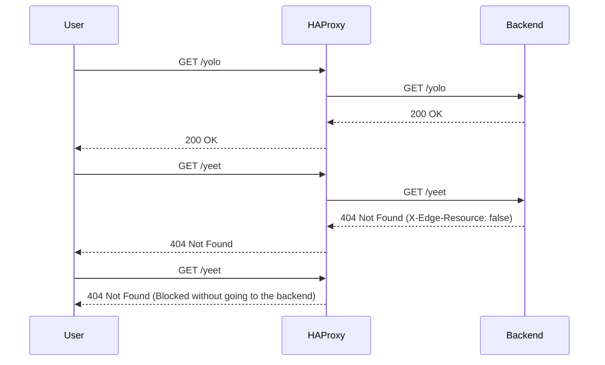

# Yeet Blocker

## What is this thing?

This repo is a mess of scripts to do a proof of concept of enabling backends to communicate with haproxy via headers and enforce access rules.

It uses HAProxy's [Lua](https://www.haproxy.com/documentation/haproxy-lua-api/getting-started/introduction/) capabilities and writes to in memory maps using the [runtime api](https://www.haproxy.com/documentation/haproxy-runtime-api/).

This workflow enables a backend (an app) to signal with HTTP headers in responses that a given access pattern is not allowed and should be blocking going forwards.

For example, let's say a particular endpoint is getting POST-ed to a lot but that endpoint is not a valid endpoint for POST's. In high enough volumes, this could cause issues for the backend. The backend team could write an haproxy rule to block this but that's out of their workflow and slow.

This workflow would allow them to return a special header saying that path is not valid with a POST and then future requests like that would get blocked at the edge. The backend team can write a PR in their service, then haproxy implements the rule for them at runtime, yay.

This particular POC matches **just** on path but it could be extended to match on method, logged in state, presence of parameters, etc.

## How does it work?

Our haproxy config defines a map, `path_status.map`, that defines known invalid paths. Then, at runtime, the backend can signal with a header, `X-Edge-Resource`, that a new path should be added to that list. When HAProxy gets that header, it dynamically adds it to the map using Lua and then runtime API. Going forwards, requests that match that rule will get blocked at the edge and the backend need not deal with it.

## Next steps

* Understand perf impact
* What API do we actually want for this?
* Lua docs are severely lacking
* How might we expire keys (without requiring full deploy)?
* Probably a lot more

## The flow



------------------------

Messy notes

Follow https://www.haproxy.com/blog/how-to-run-haproxy-with-docker

and then https://www.haproxy.com/documentation/haproxy-runtime-api/installation/

start haproxy

```
docker run -d \                                                           
   --name haproxy \
   --net mynetwork \
   -v $(pwd)/haproxy.cfg:/usr/local/etc/haproxy/haproxy.cfg:ro \
   -v $(pwd)/blocks.lua:/usr/local/etc/haproxy/blocks.lua:ro \
   -p 80:80 \
   -p 8404:8404 \
   haproxytech/haproxy-alpine:2.4
```

docker run -d \
   --name haproxy \
   --net mynetwork \                                           
   -v $(pwd)/haproxy.cfg:/usr/local/etc/haproxy/haproxy.cfg:ro \
   -v $(pwd)/blocks.lua:/usr/local/etc/haproxy/blocks.lua:ro \
   -v $(pwd)/path_status.map:/usr/local/etc/haproxy/path_status.map:rw \
   -p 80:80 \
   -p 8404:8404 \
   haproxytech/haproxy-alpine:2.4

reload haproxy config

```
docker kill -s HUP haproxy
```

```
docker run -d --name yolo --net mynetwork -p 8080:8080 yolo 
```