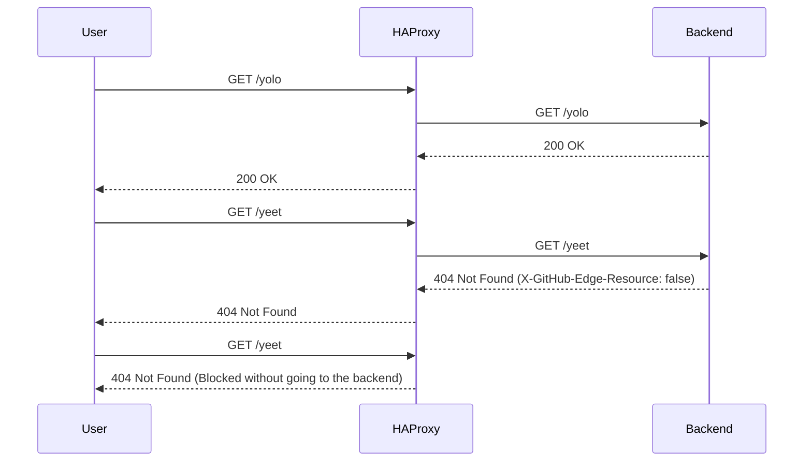

# Dynamic Request Blocking with HAProxy and Lua

Ever needed to block malicious or invalid requests at the edge of your infrastructure, but found yourself stuck in a slow deployment cycle? Here's how we built a system that lets backend services dynamically signal HAProxy to block problematic traffic patterns in real-time.

## The Problem

Picture this: You're running a service that's getting hammered with POST requests to an endpoint that only accepts GET requests. Your backend team needs to block these requests, but the traditional process involves:

1. Writing new HAProxy rules
2. Creating a config PR
3. Waiting for review
4. Deploying the changes
5. Hoping nothing breaks

This process is slow and takes engineers out of their normal workflow. What if your backend service could simply tell HAProxy "hey, block this pattern" directly through its response headers?

## The Solution: Dynamic Edge Blocking

We built a proof-of-concept system that does exactly this using HAProxy's Lua capabilities and runtime API. Here's how it works:

1. HAProxy maintains a map of blocked paths
2. Backend services can signal invalid patterns via a response header
3. Our Lua script captures these signals and updates HAProxy's rules in real-time
4. Future matching requests get blocked at the edge, never reaching your backend

Here's a sequence diagram showing the flow:



## How It Works Under the Hood

The magic happens through three main components:

1. **HAProxy Configuration**: We define a map file that stores our blocked paths
2. **Lua Script**: Handles the dynamic updates when it sees the special header
3. **Runtime API**: Allows us to modify HAProxy's behavior without restarts

Let's look at each component:

### HAProxy Configuration

```haproxy
global
  stats socket /var/run/api.sock user haproxy group haproxy mode 660 level admin expose-fd listeners
  log stdout format raw local0 info
  lua-load /usr/local/etc/haproxy/blocks.lua

defaults
  mode http
  timeout client 10s
  timeout connect 5s
  timeout server 10s
  timeout http-request 10s
  log global

frontend stats
  bind *:8404
  stats enable
  stats uri /
  stats refresh 10s

frontend myfrontend
  bind :80
  default_backend webservers
  http-request set-var(txn.ghpath) path
  
  # eventually, want to match on verb, logged_in state, etc
  # check if the given path is blocked already
  http-request deny deny_status 404 if { path,lower,map_str(/etc/haproxy/path_status.map) -m found }

backend webservers
  server s1 yolo:8080 check
  http-response lua.process_response
```

### Lua Implementation

Our Lua script watches for the special header and updates HAProxy's path map accordingly:

```lua
core.register_action("process_response", { "http-res" }, function(txn)
  txn.http:res_add_header("X-Custom-Header", "Processed by Lua")

  local headers = txn.http:res_get_headers()

  -- TODO: Add error handling for missing header
  local backend_directive = headers["x-github-edge-resource"][0]

  -- check if backend_directive is not nil
  if backend_directive then
    core.log(core.info, "X-GitHub-Edge-Resource: " .. backend_directive)
    -- split the string on dash
    local parts = {}
    for part in string.gmatch(backend_directive, "([^%-]+)") do
        table.insert(parts, part)
    end

    -- format is (logged in state)-(code to return)
    -- check if first part is set to false
    if parts[1] == "false" then
        txn.http:res_add_header("X-Blocked-By-Glb", "true")

        core.log(core.info, "adding blocked path: " .. txn:get_var("txn.ghpath"))
        core.set_map("/etc/haproxy/path_status.map", txn:get_var("txn.ghpath"), 404)
    end
  else
    core.log(core.info, "X-GitHub-Edge-Resource: none-provided")
  end
end)
```

### Example Backend Response

Here's what a blocking response from your backend might look like:

```http
HTTP/1.1 404 Not Found
X-GitHub-Edge-Resource: false
Content-Type: application/json

{
    "error": "Invalid endpoint"
}
```

## Setting It Up

Here's how to try it yourself:

```bash
# Start HAProxy with our configuration
docker run -d \
   --name haproxy \
   --net mynetwork \
   -v $(pwd)/haproxy.cfg:/usr/local/etc/haproxy/haproxy.cfg:ro \
   -v $(pwd)/blocks.lua:/usr/local/etc/haproxy/blocks.lua:ro \
   -v $(pwd)/path_status.map:/usr/local/etc/haproxy/path_status.map:rw \
   -p 80:80 \
   -p 8404:8404 \
   haproxytech/haproxy-alpine:2.4
```

## Future Improvements

While this proof-of-concept focuses on path-based blocking, the system could be extended to handle:

- Method-based rules (GET, POST, etc.)
- Authentication state
- Query parameters
- Request headers
- Temporary blocks with expiration

Some challenges we're still exploring:

- Performance impact measurement
- API design refinement
- Key expiration strategies
- Documentation improvements

## Conclusion

This approach gives backend teams more control over their traffic patterns while maintaining the benefits of edge-level blocking. It's a powerful example of using HAProxy's Lua capabilities to build dynamic, responsive infrastructure.

The full code and implementation details are available in our [GitHub repository](link-to-your-repo). 